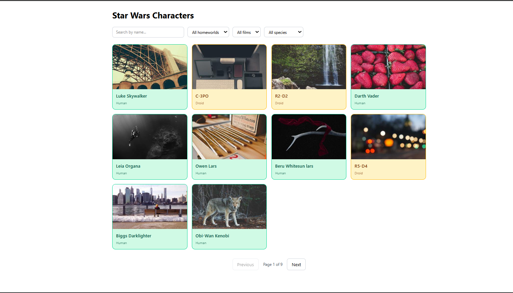
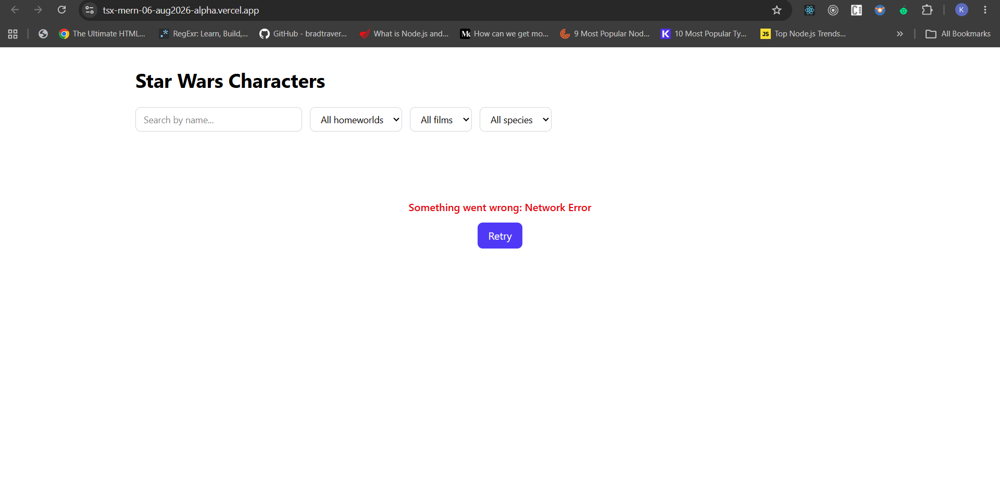

# Star Wars Character Explorer

A React + TypeScript app that browses Star Wars characters via the [SWAPI](https://www.swapi.tech/) API, with pagination, search, filtering, species-based card coloring, and detailed character/homeworld info in a modal.

**Live app:** https://tsx-mern-06-aug2026-alpha.vercel.app/

---

## Tech Stack

- **React 18 + TypeScript**
- **Vite** (build tool)
- **Tailwind CSS** — styling and animations
- **TanStack React Query** — data fetching, caching, loading/error states
- **Axios** — HTTP client
- **SWAPI** (`https://www.swapi.tech/api`) — Star Wars data source
- **Picsum Photos** — random character images

---

## Features

- ✅ Paginated character list (`/people` endpoint)
- ✅ Loading state while fetching/refetching
- ✅ Error state with retry, if the API is unreachable
- ✅ Character cards colored by species, with hover animation
- ✅ Click-to-open modal with:
  - Name (header)
  - Height (converted to meters)
  - Mass (kg)
  - Date added to API (`dd-MM-yyyy`)
  - Number of films appeared in
  - Birth year
  - Homeworld: name, terrain, climate, resident count
- ✅ **Search** — partial/full name match
- ✅ **Filter** — by homeworld, film, or species, combinable with search
- ✅ Responsive layout (mobile → desktop)

---

## Screenshots

| Character Grid                               | Character Modal                                |
| -------------------------------------------- | ---------------------------------------------- |
|  |  |

| Search & Filters                                | Error State                             |
| ----------------------------------------------- | --------------------------------------- |
|  |  |

---

## Getting Started

```bash
# clone
git clone https://github.com/keerthana0403/tsx-mern-06Aug2026.git
cd tsx-mern-06Aug2026

# install
npm install

# run locally
npm run dev

# build for production
npm run build
```

The app runs against the public SWAPI API — no environment variables or API keys are required.

---

## Project Structure

```
src/
  api/           # SWAPI client functions (getPeople, getPerson, getPlanet, search/filter fetchers)
  components/    # CharacterCard, CharacterGrid, CharacterModal, Pagination, SearchFilterBar, LoadingState, ErrorState
  hooks/         # React Query wrappers: usePeople, usePerson, usePlanet, useAllPeople, useCharacterSearch, useSpeciesMap, useFilterOptions
  types/         # Person, Planet, Film, Species, ApiResponse interfaces
  utils/         # formatDate, cmToMeters, speciesColorMap
  App.tsx
  main.tsx
```

---

## Implementation Notes

### Pagination vs. Search/Filter

The default browsing view uses SWAPI's server-side pagination (`/people?page=n&limit=10`). SWAPI only supports server-side search by **name** (`?search=`) — it has no server-side filtering by homeworld, film, or species. So when a search term or filter is active, the app fetches the full people dataset once (~82 records, cached indefinitely via React Query), and performs search + filtering **client-side**, combinable across all criteria, then paginates the filtered results in the UI.

### Species-based coloring

SWAPI's person objects don't include a `species` field directly. Instead, each **species** resource lists its member people (`species.properties.people[]`). The app fetches all species (expanded) once and inverts that into a `personUrl → species` lookup, which drives both the card color and the species filter. Characters not found in any species list are treated as Human, SWAPI's implicit default for most characters.

### Known API quirks

- SWAPI's `limit` query param is capped server-side (max ~10 per page regardless of what's requested), so any "fetch everything" call must page through `total_pages` rather than trusting a single large-limit request.
- Because the dataset only has 82 characters spread across 60 planets, some homeworld filter options will correctly show "no matching characters" — that reflects real data sparsity, not a bug.

---

## Testing

```bash
npm test
```

Includes an integration test verifying the character modal opens and displays the correct person's information on card click.

---

## Submission

- **GitHub repo:** `tsx-mern-06Aug2026`
- **Hosted app:** https://tsx-mern-06-aug2026-alpha.vercel.app/
